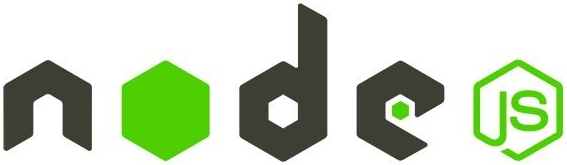

# NodeJsApiTemplate

## Plantilla para la creación de apis usando nodejs!!!!

##### Includes API Server utilities:

* [bcryptjs](https://www.npmjs.com/package/bcryptjs)
  * Optimized bcrypt in JavaScript with zero dependencies. Compatible to the C++ bcrypt binding on node.js and also working in the browser. bcrypt es una función de hash de contraseña diseñada por Niels Provos y David Mazières, basada en el cifrado Blowfish y presentada en USENIX en 1999.
* [express ](https://www.npmjs.com/package/express)
  * Fast, unopinionated, minimalist web framework for node.
* [jsonwebtoken](https://www.npmjs.com/package/jsonwebtoken)
  * JSON Web Token implementation (symmetric and asymmetric)
* [mongoose](https://www.npmjs.com/package/mongoose)
  * Mongoose is a MongoDB object modeling tool designed to work in an asynchronous environment. Mongoose supports both promises and callbacks.
* [mongo-seeding](https://www.npmjs.com/package/mongo-seeding)
  * The ultimate solution for populating your MongoDB database. Define the data in JavaScript or JSON files. Import collections and documents!
* [mongo-seeding-cli](https://www.npmjs.com/package/mongo-seeding-cli)
  * The ultimate CLI tool for populating your MongoDB database 🚀.Define MongoDB documents in JSON, JavaScript or even TypeScript file(s). Import them with command line interface.
* [mongoose-paginate](https://www.npmjs.com/package/mongoose-paginate)
  * Pagination plugin for Mongoose
* [cors](https://www.npmjs.com/package/cors)
  * CORS is a node.js package for providing a Connect/Express middleware that can be used to enable CORS with various options.
* [joi](https://www.npmjs.com/package/joi)
  * The most powerful schema description language and data validator for JavaScript.
* [supertest](https://www.npmjs.com/package/supertest)
  * HTTP assertions made easy via superagent.
* [winston](https://www.npmjs.com/package/winston)
  * A logger for just about everything.
* [winston-daily-rotate-file](https://www.npmjs.com/package/winston-daily-rotate-file)
  * A transport for winston which logs to a rotating file. Logs can be rotated based on a date, size limit, and old logs can be removed based on count or elapsed days.
* [app-root-path](https://www.npmjs.com/package/app-root-path)
  * This simple module helps you access your application's root path from anywhere in the application without resorting to relative paths like require("../../path").
* [swagger-ui-express](https://www.npmjs.com/package/swagger-ui-express)
  * This module allows you to serve auto-generated swagger-ui generated API docs from express, based on a swagger.json file. The result is living documentation for your API hosted from your API server via a route.
* [helmet](https://www.npmjs.com/package/helmet)
  * Helmet helps you secure your Express apps by setting various HTTP headers. It's not a silver bullet, but it can help!
* [dotenv](https://www.npmjs.com/package/dotenv)
  * Dotenv is a zero-dependency module that loads environment variables from a `.env` file into `process.env`
* [assert](https://www.npmjs.com/package/assert)
  * The assert module from Node.js, for the browser.
* [chai](https://www.npmjs.com/package/chai)
  * Chai is a BDD / TDD assertion library for node and the browser that can be delightfully paired with any javascript testing framework.
* [jsdom](https://www.npmjs.com/package/jsdom)
  * jsdom is a pure-JavaScript implementation of many web standards, notably the WHATWG DOM and HTML Standards, for use with Node.js. In general, the goal of the project is to emulate enough of a subset of a web browser to be useful for testing and scraping real-world web applications.

##### Development utilities:

* [nodemon](https://www.npmjs.com/package/nodemon)
  * nodemon is a tool that helps develop node.js based applications by automatically restarting the node application when file changes in the directory are detected.
* [eslint](https://www.npmjs.com/package/eslint)
  * ESLint is a tool for identifying and reporting on patterns found in ECMAScript/JavaScript code.
* [mocha](https://www.npmjs.com/package/mocha)
  * ☕️ Simple, flexible, fun JavaScript test framework for Node.js & The Browser ☕️
* [supertest](https://www.npmjs.com/package/supertest)
  * HTTP assertions made easy via superagent.

## Setup

```
npm install
```

## Lint

```
npm run lint
```

## Test

```
npm run test
```

## Development

```
npm run dev
```

## Links

+  Backend of Vidly, an imaginary video rental app <https://github.com/mosh-hamedani/vidly-api-node>
+ Documenting a Node.js REST API using Swagger <https://www.section.io/engineering-education/documenting-node-js-rest-api-using-swagger/>
+ Simple Node.js REST API. <https://github.com/mwangiKibui/node.js-simple-api>
+ How to implement and use Swagger in Node.js <https://javascript.plainenglish.io/how-to-implement-and-use-swagger-in-nodejs-d0b95e765245>
+ SuperTest <https://github.com/visionmedia/supertest>
+ TESTEANDO UN API REST NODE.JS CON MOCHA <http://xurxodev.com/testeando-un-api-rest-con-mocha/>
+ Supertest fails on Content-Type #187 <https://github.com/visionmedia/supertest/issues/187>
+ Writing Test with Supertest and Mocha for Expressjs Routes <https://medium.com/@ehtemam/writing-test-with-supertest-and-mocha-for-expressjs-routes-555d2910d2c2>
+ Dead-Simple API Tests With SuperTest, Mocha, and Chai <https://dev-tester.com/dead-simple-api-tests-with-supertest-mocha-and-chai/>
+ Express 4 middleware when route is not found (finalhandler not called): how to check for it? <https://stackoverflow.com/questions/38681318/express-4-middleware-when-route-is-not-found-finalhandler-not-called-how-to-c>
+ node js route not found <https://stackoverflow.com/questions/28566487/node-js-route-not-found>
+ Express.js route not found <https://stackoverflow.com/questions/48954699/express-js-route-not-found>
+ How to usetextfunctioninResponse <https://www.tabnine.com/code/javascript/functions/supertest/Response/text>
+ Minimal test example for supertest <https://www.thiscodeworks.com/minimal-test-example-for-supertest-api-testing-nodejs-supertest/61e18883ddff800015669cba>
+ Server Testing Stack with Chai, jsdom, and SuperTest <https://codewithhasan.medium.com/server-testing-stack-with-chai-jsdom-and-supertest-1dc0213786ef>
+ Supercharge your nodejs testing using supertest <https://mistryakshar54.medium.com/supercharge-your-nodejs-testing-using-supertest-ecaa90497e2f>